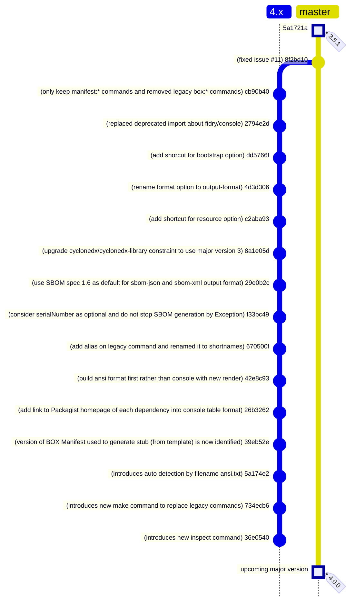

<!-- markdownlint-disable MD013 MD033 -->
# BOX Manifest

Main goal of this project is to write a manifest in any [PHP Archive (PHAR)][php-phar] built with the [BOX][box-project] tool.

## Features

Provides a Symfony Console Application with the binary command `box-manifest` that :

- Can generate manifest in [CycloneDX SBOM Standard][cyclonedx] format (`sbom-json` or `sbom-xml`)
- Can generate manifest in a simple key-value pairs `plain` text format (`key: value`)
- Can generate manifest in a decorated text format `console-style` or `console-table` (distinguish direct dependencies requirement and other uses)
- Can generate manifest in a custom user format
- Can generate a stub that should be able to display one or all manifests provided by the PHP Archive
- Can inspect a PHAR to find and display manifests contents

## Version Compatibility

| Version            | Status             | Box Project Compatibility | PHP      |
|--------------------|--------------------|---------------------------|----------|
| `4.0.x`            | Active development | `4.6.x`                   | `>= 8.2` |
| `3.0.x` to `3.5.x` | Active support     | `4.0.x` to `4.3.x`        | `>= 8.1` |
| `2.0.x` to `2.3.x` | End Of Life        | `4.0.x` to `4.2.x`        | `>= 8.1` |
| `1.0.x` to `1.2.0` | End Of Life        | `3.x`                     | `>= 7.4` |

## Documentation

All the documentation is available on [website][docs-website], generated from the [docs][docs-folder] folder.

## Contributors

- Laurent Laville (Lead Developer)

## Roadmap

[php-phar]: https://www.php.net/phar
[box-project]: https://github.com/box-project/box
[cyclonedx]: https://github.com/CycloneDX
[docs-folder]: https://github.com/llaville/box-manifest/tree/4.x/docs
[docs-website]: https://llaville.github.io/box-manifest/4.0
