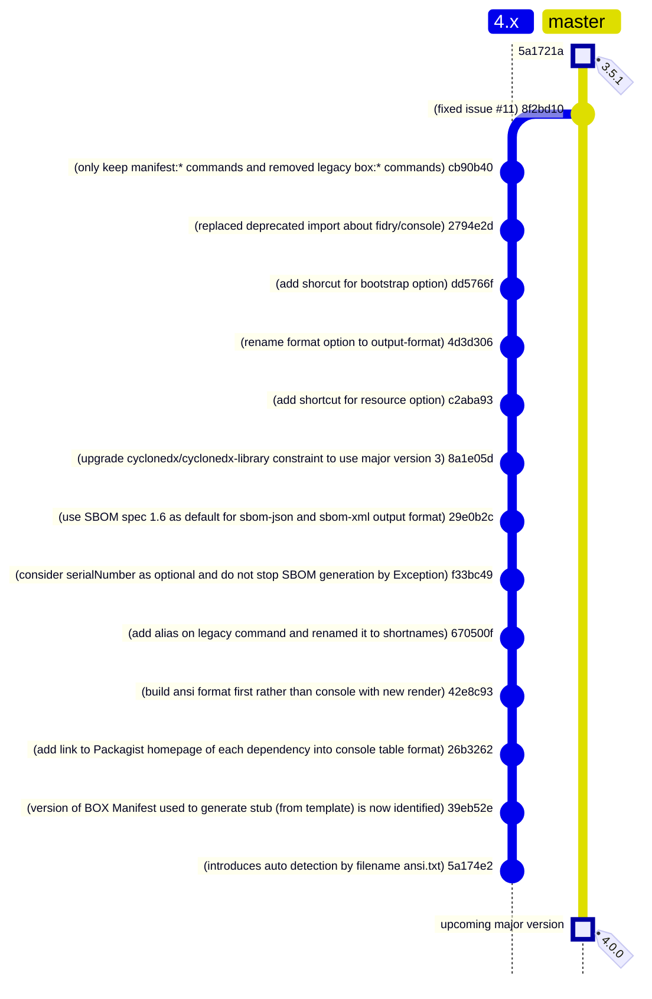

<!-- markdownlint-disable MD013 MD033 -->
# BOX Manifest

Main goal of this project is to write a manifest in any [PHP Archive (PHAR)](https://www.php.net/phar)
built with the [BOX](https://github.com/box-project/box) tool.

## Features

Provides a Symfony Console Application with the binary command `box-manifest` that is able to :

- generate any manifest in multiple format (`plain`, `ansi`, `console`, `sbom` XML or JSON) even in a custom format.
- generate a custom phar stub that will support `--manifest` option at runtime.
- compile your PHAR with a wrapper around standard BOX compile command (with bootstrapping support: `--bootstrap` option).
- display information about the PHAR extension or file.
- validate the BOX configuration file.

**IMPORTANT** :

Major version 3 will not use anymore the [`cweagans/composer-patches`](https://github.com/cweagans/composer-patches)
composer plugin to patch `humbug/box` at install runtime.

## Version Compatibility

| Version            | Status             | Box Project Compatibility |
|--------------------|--------------------|---------------------------|
| `3.0.x` to `3.5.x` | Active support     | `4.0.x` to `4.3.x`        |
| `2.0.x` to `2.3.x` | End Of Life        | `4.0.x` to `4.2.x`        |
| `1.0.x` to `1.2.0` | End Of Life        | `3.x`                     |

## Documentation

All the documentation is available on [website](https://llaville.github.io/box-manifest/3.x),
generated from the [docs](https://github.com/llaville/box-manifest/tree/master/docs) folder.

## Contributors

- Laurent Laville (Lead Developer)

## Roadmap

