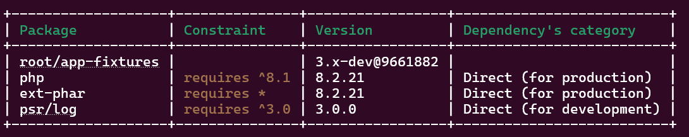
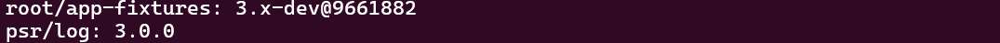

<!-- markdownlint-disable MD013 MD027 MD029 MD033 MD046 -->
# Generate your PHAR bootstrapping file

Of course running CLI commands to verify contents is not so hard. For example:

```shell
php -r "var_export((new Phar(getcwd() . '/app-fixtures.phar'))['manifest.txt']->getContent());"
```

But we may expect a better user experience. Adding a `--manifest` option that will be able to :

- search for the first manifest available in a priority files list.
- show a specific manifest file.

## :material-numeric-1-box: Create your stub

Make for example this stub (see **Output** tab), either manually or with the following command.

=== "Command"

    ```shell
    box-manifest make -r console-table.txt -r manifest.txt stub
    ```

=== "Output"

    ```php
    <?php

    // default stub template @generated by BOX Manifest 4.0.0

    $withManifest = array_search('--manifest', $argv);
    $withoutAnsi = array_search('--no-ansi', $argv);

    if ($withManifest !== false) {
        $manifestDir = '.box.manifests/';
        $resources = (($argc - 1 > $withManifest) && !str_starts_with($argv[$withManifest + 1], '-')) ? [$argv[$withManifest + 1]] : ['console-table.txt', 'manifest.txt'];

        foreach ($resources as $resource) {
            $res = str_replace($manifestDir, '', $resource);
            $filename = "phar://" . __FILE__ . "/{$manifestDir}{$res}";
            if (file_exists($filename)) {
                $manifest = file_get_contents($filename);
                if ($withoutAnsi !== false) {
                    $manifest = preg_replace('#\\x1b[[][^A-Za-z]*[A-Za-z]#', '', $manifest);
                }
                echo $manifest, PHP_EOL;
                exit(0);
            } elseif (count($resources) === 1) {
                echo sprintf('Manifest "%s" is not available in this PHP Archive.', $resource), PHP_EOL;
                exit(2);
            }
        }
        echo 'No manifest found in this PHP Archive', PHP_EOL;
        exit(1);
    }


    // No PHAR config

    __HALT_COMPILER(); ?>
    ```

> [!NOTE]
>
> Default template `resources/default_stub.template` is used, but you can make your own if you want to change behaviour.
>
> In this case, specify the `--template /path/to/your/template` option in previous command. For example:
>
> === "Command"
>
>     ```shell
>     box-manifest make -r console-table.txt -r manifest.txt --template resources/empty_stub.template --output-stub my-stub.php stub
>     ```
>
> === "Output"
>
>     ```php
>     <?php
>
>     // empty stub template @generated by BOX Manifest 4.0.0
>
>
>
>     // No PHAR config
>
>     __HALT_COMPILER(); ?>
>     ```

## :material-numeric-2-box: Declare it

Declare it in your BOX config file, with excerpt :

```json
{
  "stub": "my-stub.php"
}
```

## :material-numeric-3-box: Compile your PHP Archive

Then compile your PHP Archive.

## :material-numeric-4-box: Display a manifest on runtime

:material-numeric-1-box: You are now able to display either the first manifest available (`console.txt` is included and is on top of priority list)

=== "Command"

    ```shell
    ./app-fixtures.phar --manifest
    ```

=== "Output"

    

:material-numeric-2-box: Or the second manifest available (`manifest.txt`)

=== "Command"

    ```shell
    ./app-fixtures.phar --manifest manifest.txt
    ```

=== "Output"

    

:material-numeric-3-box: And if you ask for an unavailable manifest into the PHP Archive,

=== "Command"

    ```shell
    ./app-fixtures.phar --manifest sbom.json
    ```

=== "Output"

    ```text
    Manifest "sbom.json" is not available in this PHP Archive.
    ```
