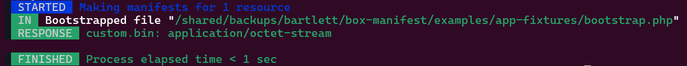

<!-- markdownlint-disable MD013 MD033 -->
# Manifest in free format

> [!WARNING]
>
> Additional free format is in charge of User to implement it.

This class should implement the `Bartlett\BoxManifest\Composer\ManifestBuilderInterface` contract and must be loadable,
either by your autoloader or with bootstrap helper feature (see `--bootstrap|-b` option).

=== ":octicons-file-code-16: examples/MyCustomFormat.php"

    ```php linenums="1" hl_lines="9"
    <?php

    use Bartlett\BoxManifest\Composer\ManifestBuilderInterface;

    class MyCustomFormat implements ManifestBuilderInterface
    {
        public function __invoke(array $content): string
        {
            return var_export($content['installed.php'], true);  # (1)
        }
    }
    ```

    1.  Here the result produced by php [var_export][var-export] function did not contains PHP extensions requirements.
        You should use instead content of **composer.json** or **composer.lock**.

=== ":octicons-file-code-16: `vendor/composer/installed.php`"

    ```php
    <?php return array(
        'root' => array(
            'name' => 'root/app-fixtures',
            'pretty_version' => '3.x-dev',
            'version' => '3.9999999.9999999.9999999-dev',
            'reference' => '966188206a550366b0e3fe30b6722a16d2246bce',
            'type' => 'library',
            'install_path' => __DIR__ . '/../../',
            'aliases' => array(),
            'dev' => true,
        ),
        'versions' => array(
            'psr/log' => array(
                'pretty_version' => '3.0.0',
                'version' => '3.0.0.0',
                'reference' => 'fe5ea303b0887d5caefd3d431c3e61ad47037001',
                'type' => 'library',
                'install_path' => __DIR__ . '/../psr/log',
                'aliases' => array(),
                'dev_requirement' => true,
            ),
            'root/app-fixtures' => array(
                'pretty_version' => '3.x-dev',
                'version' => '3.9999999.9999999.9999999-dev',
                'reference' => '966188206a550366b0e3fe30b6722a16d2246bce',
                'type' => 'library',
                'install_path' => __DIR__ . '/../../',
                'aliases' => array(),
                'dev_requirement' => false,
            ),
        ),
    );
    ```

> [!IMPORTANT]
>
> These commands and results are applied from `examples/app-fixtures` immutable demo folder.
> Must be your current working directory.

## :material-numeric-1-box: With legacy command

> [!WARNING]
>
> We've dropped legacy commands, but we still show syntax usage to help Users of version 3 for a smooth migration.

=== "Command"

    ```shell
    box-manifest manifest:build -f MyCustomFormat -b bootstrap.php
    ```

=== "Output"

    ```text
    array (
      'root' =>
      array (
        'name' => 'root/app-fixtures',
        'pretty_version' => '3.x-dev',
        'version' => '3.9999999.9999999.9999999-dev',
        'reference' => '966188206a550366b0e3fe30b6722a16d2246bce',
        'type' => 'library',
        'install_path' => '/shared/backups/bartlett/box-manifest/examples/app-fixtures/vendor/composer/../../',
        'aliases' =>
        array (
        ),
        'dev' => true,
      ),
      'versions' =>
      array (
        'psr/log' =>
        array (
          'pretty_version' => '3.0.0',
          'version' => '3.0.0.0',
          'reference' => 'fe5ea303b0887d5caefd3d431c3e61ad47037001',
          'type' => 'library',
          'install_path' => '/shared/backups/bartlett/box-manifest/examples/app-fixtures/vendor/composer/../psr/log',
          'aliases' =>
          array (
          ),
          'dev_requirement' => true,
        ),
        'root/app-fixtures' =>
        array (
          'pretty_version' => '3.x-dev',
          'version' => '3.9999999.9999999.9999999-dev',
          'reference' => '966188206a550366b0e3fe30b6722a16d2246bce',
          'type' => 'library',
          'install_path' => '/shared/backups/bartlett/box-manifest/examples/app-fixtures/vendor/composer/../../',
          'aliases' =>
          array (
          ),
          'dev_requirement' => false,
        ),
      ),
    )
    ```

## :material-numeric-2-box: With pipeline command

=== "Command"

    ```shell
    box-manifest make -r custom.bin -b bootstrap.php -f MyCustomFormat -vvv build
    ```

=== "Output (debug mode)"

    

=== ":octicons-file-code-16: `custom.bin`"

    ```text
    array (
      'root' =>
      array (
        'name' => 'root/app-fixtures',
        'pretty_version' => '3.x-dev',
        'version' => '3.9999999.9999999.9999999-dev',
        'reference' => '966188206a550366b0e3fe30b6722a16d2246bce',
        'type' => 'library',
        'install_path' => '/shared/backups/bartlett/box-manifest/examples/app-fixtures/vendor/composer/../../',
        'aliases' =>
        array (
        ),
        'dev' => true,
      ),
      'versions' =>
      array (
        'psr/log' =>
        array (
          'pretty_version' => '3.0.0',
          'version' => '3.0.0.0',
          'reference' => 'fe5ea303b0887d5caefd3d431c3e61ad47037001',
          'type' => 'library',
          'install_path' => '/shared/backups/bartlett/box-manifest/examples/app-fixtures/vendor/composer/../psr/log',
          'aliases' =>
          array (
          ),
          'dev_requirement' => true,
        ),
        'root/app-fixtures' =>
        array (
          'pretty_version' => '3.x-dev',
          'version' => '3.9999999.9999999.9999999-dev',
          'reference' => '966188206a550366b0e3fe30b6722a16d2246bce',
          'type' => 'library',
          'install_path' => '/shared/backups/bartlett/box-manifest/examples/app-fixtures/vendor/composer/../../',
          'aliases' =>
          array (
          ),
          'dev_requirement' => false,
        ),
      ),
    )
    ```

<!-- markdownlint-disable-next-line MD053 -->
[var-export]: https://www.php.net/manual/en/function.var-export.php
