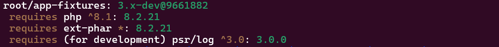

<!-- markdownlint-disable MD013 MD033 -->
# Manifest in `ansi` (decorated) TEXT format

> [!IMPORTANT]
>
> These commands and results are applied from `examples/app-fixtures` immutable demo folder.
> Must be your current working directory.

## :material-numeric-1-box: With legacy command

=== "Command"

    ```shell
    box-manifest build -f ansi
    ```

=== "Output"

    


## :material-numeric-2-box: With new pipeline command

=== "Command"

    ```shell
    box-manifest make -r ansi.txt build
    ```

=== "Output"

    
