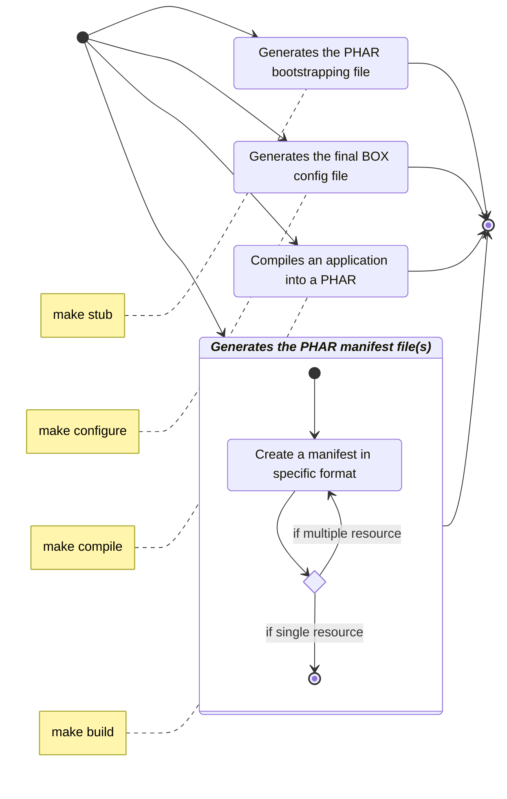

<!-- markdownlint-disable MD013 -->
# Capabilities

Since we have :

- [Composer][composer] (a Dependency Manager for PHP) with `show` command that displays detailed information about a package,
- [Docker][docker-manifest] `manifest` command to manage Docker image manifests and manifest lists,
- **SBOM** (Software Bill of Materials) as industry standards as a key building block in software security and [software supply chain][sbom] risk management,

No solution existed before `BOX Manifest` to implement the same feature into PHAR (PHP Archive) distribution.

From first version until latest one available (4.6), the [`BOX`][box-project] project does not add yet ability
to include inventory of your software (dependencies).

This is the goal of `BOX Manifest` companion : add this missing but so important feature.

- Generates individual file in specific format (plain text, Symfony Console Table, SBOM XML or JSON, and more ...)
- Identify them into the BOX configuration file
- Compiles the PHAR distribution of your application including all your manifests

This project has evolved since three major versions, and now happy to announce a next step improvement with major version 4.

## Pipeline of `make` command

The following diagram describe the behavior of the new `make` command.

> [!NOTE]
>
> The `make` command is only available with version 4.0 or greater

> [!IMPORTANT]
>
> If these default behaviours does not match your needs,
> you have also possibility to add your own stage(s) in the pipeline at any position.

[box-project]: https://github.com/box-project/box
[sbom]: https://en.wikipedia.org/wiki/Software_supply_chain
[composer]: https://getcomposer.org/
[docker-manifest]: https://docs.docker.com/reference/cli/docker/manifest/
