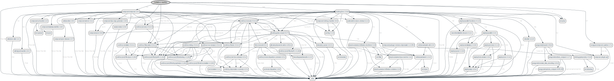

<!-- markdownlint-disable MD013 -->
# Getting Started

## Requirements

* PHP 7.4 or greater
* ext-phar
* PHPUnit 9 or greater (if you want to run unit tests)



Generated with [fork](https://github.com/markuspoerschke/graph-composer/tree/add-options-to-exclude) of [clue/graph-composer](https://github.com/clue/graph-composer).
Read more on [PR request](https://github.com/clue/graph-composer/pull/45).

## Installation

### With Composer

Install the BOX Manifest with [Composer](https://getcomposer.org/).
If you don't know yet what is composer, have a look [on introduction](http://getcomposer.org/doc/00-intro.md).

```shell
composer require bartlett/box-manifest
```

### With Git

The BOX Manifest can be directly used from [GitHub](https://github.com/llaville/box-manifest.git)
by cloning the repository into a directory of your choice.

```shell
git clone https://github.com/llaville/box-manifest.git
```

## Quick Started

### Basic Usage

Declare your manifest format in your `box.json` or `box.json.dist` configuration file (`metadata` setting).

basic simple text :

```json
{
  "metadata": "Bartlett\\BoxManifest\\Composer\\ManifestFactory::toText"
}
```

Then build your PHP Archive (PHAR) via the `bin/box compile` command.

### Examples

Manifest of `bartlett/box-manifest` in TEXT format

```text
bartlett/box-manifest: dev-master
amphp/amp: v2.6.1
amphp/byte-stream: v1.8.1
amphp/parallel: v1.4.1
amphp/parallel-functions: v1.1.0
amphp/parser: v1.0.0
amphp/process: v1.1.3
amphp/serialization: v1.0.0
amphp/sync: v1.4.2
composer/package-versions-deprecated: 1.11.99.5
composer/pcre: 1.0.1
composer/semver: 3.2.9
composer/xdebug-handler: 3.0.1
cweagans/composer-patches: 1.7.2
fidry/console: 0.2.0
humbug/box: 3.16.0
humbug/php-scoper: 0.17.0
jetbrains/phpstorm-stubs: v2021.3
justinrainbow/json-schema: 5.2.11
laravel/serializable-closure: v1.1.0
nikic/iter: v2.2.0
nikic/php-parser: v4.13.2
paragonie/constant_time_encoding: v2.5.0
paragonie/pharaoh: v0.6.0
paragonie/random_compat: v9.99.100
paragonie/sodium_compat: v1.17.0
phpdocumentor/reflection-common: 2.2.0
phpdocumentor/reflection-docblock: 5.3.0
phpdocumentor/type-resolver: 1.6.0
psr/container: 1.1.2
psr/event-dispatcher: 1.0.0
psr/log: 1.1.4
seld/jsonlint: 1.8.3
symfony/console: v5.4.3
symfony/deprecation-contracts: v2.5.0
symfony/event-dispatcher-contracts: v2.5.0
symfony/filesystem: v5.4.3
symfony/finder: v5.4.3
symfony/polyfill-ctype: v1.24.0
symfony/polyfill-intl-grapheme: v1.24.0
symfony/polyfill-intl-normalizer: v1.24.0
symfony/polyfill-mbstring: v1.24.0
symfony/polyfill-php80: v1.24.0
symfony/polyfill-php81: v1.24.0
symfony/process: v5.4.3
symfony/serializer: v5.4.3
symfony/service-contracts: v2.5.0
symfony/string: v5.4.3
symfony/var-dumper: v5.4.3
thecodingmachine/safe: v1.3.3
ulrichsg/getopt-php: v3.4.0
webmozart/assert: 1.10.0
webmozart/path-util: 2.3.0
```
