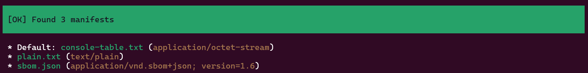

<!-- markdownlint-disable MD013 MD024 MD046 -->
# Inspect

Once you've built your PHP Archive, you'll be happy to retrieve easily what manifests are embedded,
and what formats are available.

This is the goal of the new `inspect` command.

## PHAR without manifests

### :material-numeric-1-box: Pre-Condition

Suppose you've built BOX Manifest with the `box.json` config file

=== ":octicons-file-code-16: box.json"

    ```json hl_lines="25"
    {
        "main": "bin/box-manifest",
        "alias": "box-manifest-alias.phar",
        "compression": "GZ",
        "blacklist": [
            "fixtures",
            "tests",
            "Test",
            "doc",
            "dist",
            "vendor-bin"
        ],
        "directories": ["bin", "src", "vendor"],
        "directories-bin": [
            "vendor/humbug/box/res/requirement-checker",
            "resources"
        ],
        "files": [
            "autoload.php",
            "bootstrap.php"
        ],
        "files-bin": [
            "vendor/humbug/php-scoper/vendor-hotfix/.gitkeep"
        ],
        "stub": "stub.php"
    }
    ```

    The [`stub`][box-stub] setting is necessary if you want to invoke the PHAR with `--manifest` option,
    whatever there are or not, some manifests available !

=== "Pipeline Command"

    ```shell
    box-manifest make compile -c box.json
    ```

=== "Standard BOX Command"

    ```shell
    vendor/bin/box compile -c box.json
    ```

### :material-numeric-2-box: Inspection results

=== "Command"

    ```shell
    box-manifest inspect bin/box-manifest.phar
    ```

=== "Output"

    

## PHAR with manifests

### :material-numeric-1-box: Pre-Condition

Suppose you've built BOX Manifest with the `box.json.dist` config file

=== ":octicons-file-code-16: box.json.dist"

    ```json hl_lines="28-31 35-45"
    {
        "main": "bin/box-manifest",
        "alias": "box-manifest-alias.phar",
        "compression": "GZ",
        "blacklist": [
            "fixtures",
            "tests",
            "Test",
            "doc",
            "dist",
            "vendor-bin"
        ],
        "directories": [
            "bin",
            "src",
            "vendor"
        ],
        "directories-bin": [
            "vendor/humbug/box/res/requirement-checker",
            "resources"
        ],
        "files": [
            "autoload.php",
            "bootstrap.php"
        ],
        "files-bin": [
            "vendor/humbug/php-scoper/vendor-hotfix/.gitkeep",
            "console-table.txt",
            "plain.txt",
            "sbom.json",
            ".box.manifests.bin"
        ],
        "stub": "stub.php",
        "dump-autoload": false,
        "map": [
            {
                "console-table.txt": ".box.manifests/console-table.txt"
            },
            {
                "plain.txt": ".box.manifests/plain.txt"
            },
            {
                "sbom.json": ".box.manifests/sbom.json"
            }
        ]
    }
    ```

    Three manifests in different format, and meta-data file (`.box.manifests.bin`) are referenced
    by [`files-bin`][box-files] settting, and store inside PHAR on `.box.manifests/` folder by [`map`][box-map] setting.

=== "Pipeline Command"

    ```shell
    box-manifest make compile -c box.json.dist
    ```

=== "Standard BOX Command"

    ```shell
    vendor/bin/box compile -c box.json.dist
    ```

### :material-numeric-2-box: Inspection results

=== "Command"

    ```shell
    box-manifest inspect bin/box-manifest.phar
    ```

=== "Output"

    

> [!TIP]
>
> Remember that when you'll invoke the PHAR distribution with `--manifest` option (and no value),
> you'll show only the default (first one in list).
>
> In this context, we will display contents of `console-table.txt` file.
>
> For others, specify which one, with either :
>
> :material-numeric-1-box: Plain text format
>
> ```shell
> bin/box-manifest.phar --manifest plain.txt
> ```
>
> :material-numeric-2-box: CycloneDX SBOM JSON format
>
> ```shell
> bin/box-manifest.phar --manifest sbom.json
> ```

[box-stub]: https://box-project.github.io/box/configuration/#stub
[box-files]: https://box-project.github.io/box/configuration/#files-files-and-files-bin
[box-map]: https://box-project.github.io/box/configuration/#map-map
