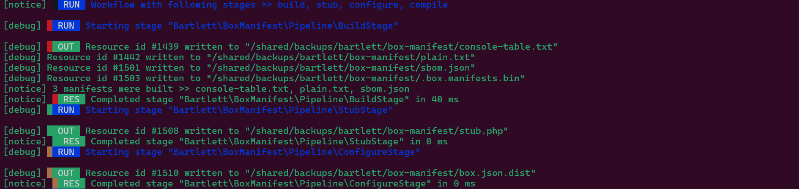
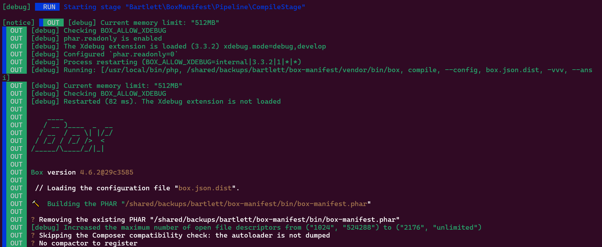
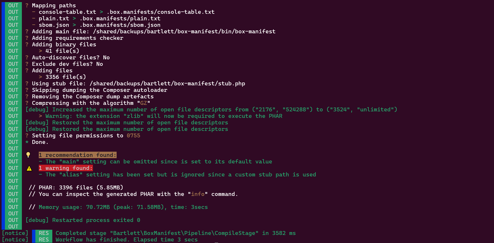

<!-- markdownlint-disable MD013 MD046 -->
# Run all stages with one command

If you're well understand each previous `make` commands of the pipeline, you want probably executed all stages at once.

You've just to combine all commands (arguments and options), to make it real.

For example: We will build all manifests for BOX Manifest distribution itself.

=== "Pipeline Command"

    ```shell
    box-manifest build stub configure compile -r console-table.txt -r plain.txt -r sbom.json --output-stub stub.php --output-conf box.json.dist -vvv
    ```

=== "Output"

    
    
    

## :material-numeric-1-box: Build manifests

Here are the part required of full above command

```shell
box-manifest make build -r console-table.txt -r plain.txt -r sbom.json
```

## :material-numeric-2-box: Build stub

Here are the part required of full above command

```shell
box-manifest make stub --output-stub stub.php
```

## :material-numeric-3-box: Configure the BOX final config file

Here are the part required of full above command

```shell
box-manifest make configure --output-stub stub.php --output-conf box.json.dist
```

## :material-numeric-4-box: Compile the PHAR distribution

Here are the part required of full above command

```shell
box-manifest make compile --output-conf box.json.dist
```

> [!TIP]
>
> Don't forget to increase verbosity (`-vvv`) to see all console logs.
